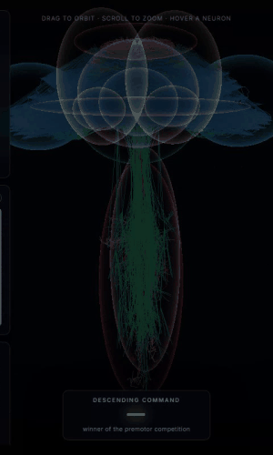
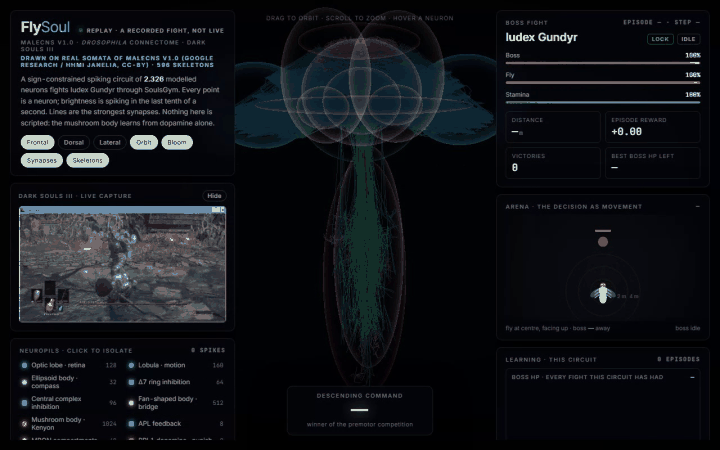
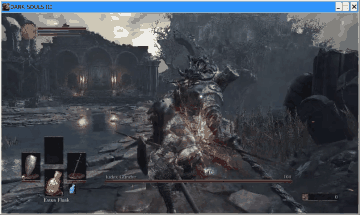

# 🪰 FlySoul: Fruit Fly Connectome plays Dark Souls III

<div align="center">

[](https://www.python.org/downloads/)
[](https://research.google/blog/a-connectomics-milestone-mapping-the-complete-male-fruit-fly-brain/)
[-red.svg)](https://github.com/amacati/SoulsGym)
[](LICENSE)

*Can a fruit fly beat Iudex Gundyr?* — It can, once in ~600 fights, and it does not learn to. A synthetic readout on its sensory stream wins one fight in three.

**An embodied bio-connectomic AI agent controlling combat in Dark Souls III using Google Research & HHMI Janelia's complete MaleCNS v1.0 fruit fly connectome.**

[Results](#-results-as-of-2026-09-19-night) • [Quickstart](#-quickstart) • [How it Works](#-how-it-works) • [3b, synthetic](#3b-synthetic-from-6-to-32-wins-in-a-day) • [References](#-scientific-references)

</div>

---

## 🎮 The Premise

In September 2026, Google Research and HHMI Janelia published the complete cellular wiring map of the male fruit fly (*Drosophila melanogaster*) central nervous system (**MaleCNS v1.0**, *Cell* 2026) — spanning **166,700 neurons** and **125 million synaptic connections**.

While other researchers gave the fly a shotgun in *Doom* or let it trade Bitcoin, we decided to test its reflexes in the ultimate proving ground of human patience and pain: **Dark Souls III**.

**FlySoul** bridges the biological neural network of a fruit fly with **SoulsGym**, driving real-time melee combat against the tutorial boss, **Iudex Gundyr**.

```
                           THE BIO-COMBAT LOOP
  +-------------------------------------------------------------------+
  |                                                                   |
  |   👹 IUDEX GUNDYR (Dark Souls III / SoulsGym)                     |
  |      [Boss HP, Distance, Rel. Angle, Attack Phase, Player HP]     |
  |                                |                                  |
  |                                v                                  |
  |   👁️ SENSORY ENCODER                                             |
  |      - Compound Eye (bearing map, constant across range)          |
  |      - Lobula: looming, object size, attack-telegraph time cells  |
  |      - Central Complex (EPG Heading Compass + Delta7 inhibition)  |
  |      - Interoception (stamina, animation lock, own health)        |
  |      - Nociceptive Afferents (Damage / Pain Receptors)            |
  |                                |                                  |
  |                                v                                  |
  |   🧠 MaleCNS v1.0 BIOLOGICAL LIF ENGINE (Numba JIT)               |
  |      - 1.8 ms axonal transmission delay                           |
  |      - Subthreshold integration: tau_m = 20ms, tau_s = 5ms       |
  |      - Three-Factor Plasticity:                                   |
  |          * Damage taken -> PPL101 aversive dopamine burst -> LTD  |
  |          * Boss struck  -> PAM reward dopamine burst -> LTP       |
  |                                |                                  |
  |                                v                                  |
  |   🦾 MOTOR READOUT (Descending Neurons / DNs)                     |
  |      - one pool per action channel, eight in all                  |
  |      - premotor cross-inhibition picks the winner                 |
  |      - the readout reports that winner; it does not choose it     |
  |                                |                                  |
  |                                v                                  |
  |   ⚔️ GAME EXECUTION -> Advance, Strafe, Retreat, Roll, Attack,    |
  |                        Heavy, Parry                               |
  |                                                                   |
  +-------------------------------------------------------------------+
```

---

## ⚡ Quickstart

### 1. Installation

Requires **Python 3.11+**:

```bash
git clone https://github.com/flysoul/flysoul.git
cd flysoul
pip install -r requirements.txt
```

### 2. Run the Autonomous Arena (Mock Mode)

You can run FlySoul right now in standalone simulation mode with zero setup — no copy of Dark Souls 3 required! It uses a high-fidelity Gymnasium simulation of Iudex Gundyr:

```bash
python run.py --episodes 10 --explore
```

The first launch runs a homeostatic calibration pass (about 90 s) that sets each
population's operating point, then caches it under `checkpoints/`. Later launches start
immediately. `--recalibrate` forces a rebuild, `--no-dashboard --quiet` gives one line
per episode, and `--no-learning` freezes the KC->MBON synapses so you can see what the
innate circuit does on its own.

### 3. Connect to Live Dark Souls III (SoulsGym)

When running Dark Souls 3 on your gaming machine:

```bash
python run.py --game --continuous --explore
```

---

## 🔬 How It Works

### 1. Biophysical Leaky Integrate-and-Fire (LIF) Kernel
Neurons are modeled as Leaky Integrate-and-Fire units with an analytic membrane decay ($\tau_m = 20.0 \text{ ms}$) and synaptic conductance decay ($\tau_s = 5.0 \text{ ms}$). Synaptic transmission features an exact **1.8 ms axonal delay queue** pre-compiled with Numba JIT:

$$\tau_m \frac{dV_i}{dt} = -(V_i - V_{\text{rest}}) + R \cdot I_i(t) + g_i(t)$$

### 2. Sensory Transduction (Visual & Spatial Orientation)
* **Compound Eye:** 128 retinal columns with Gaussian tuning over azimuth $[-\pi, +\pi]$, at
  constant amplitude and width. Bearing, object size and optic flow are carried by
  *separate* populations: every downstream cell is a threshold element, so a retina that
  dims with distance does not fade gracefully, it switches the whole circuit off.
* **Telegraph time cells:** a bank tiling time-since-attack-onset, so the circuit can
  learn *when* in Iudex's swing to act rather than being told what to do about it.
* **Central Complex Compass:** Ellipsoid Body / Protocerebral Bridge (EPG) neurons with
  Delta7-like ring inhibition, forming a heading vector toward the boss.
* **Efference copy:** locomotor commands suppress the looming pathway. Without it the fly
  reads its own approach as an object rushing in, rolls away from nothing, and never
  closes the distance.
* **Interoception & nociception:** stamina, animation lock and health; HP drops fire the
  nociceptors that drive PPL1.

### 2b. Sign constraint and homeostatic calibration
Every neuron is cholinergic or GABA/glutamatergic and keeps that sign for all of its
outputs (Dale's law), as in connectome-derived LIF models. Inhibition is not a detail
here: without it the descending pools cannot compete and whatever reads them out ends up
making the decision.

A connectome gives connectivity, not synaptic strength. `flysoul/connectome/calibration.py`
measures each population across a batch of combat states and rescales its input gain until
it sits at a target rate in Hz, with the mushroom body at ~10% sparsity. The objective
blends the mean with the *worst* state, because matching the mean alone lets a population
run hot in melee and stone dead at spawn distance.

### 3. Dopaminergic Three-Factor Plasticity (PPL101 vs. PAM)
In *Drosophila*, learning occurs primarily at Kenyon Cell (KC) to Mushroom Body Output Neuron (MBON) synapses:
* **Punishment (Taking Damage):** Activates **PPL101** dopaminergic neurons, inducing
  **Long-Term Depression (LTD)** on synapses active prior to being hit.
* **Reward (Hitting the Boss):** Activates **PAM** cluster dopaminergic neurons,
  reinforcing aggressive strike timing.
* **Compartments:** the mushroom body is split into one compartment per action channel,
  each with its own dopaminergic neurons. An **efference copy** of the action the fly
  actually executed keeps that compartment eligible for a short window. A single scalar
  reward applied to every plastic synapse can only make the whole mushroom body louder or
  quieter — never prefer one action over another.
* **Prediction error:** dopamine carries $\delta = r + \gamma V(s') - V(s)$, not $r$, with
  $V$ read linearly off the sparse Kenyon cell population. This is what makes dodging
  learnable at all: SoulsGym pays for damage dealt and damage taken and for nothing else,
  so a successful dodge scores exactly zero and is indistinguishable from standing still.
  Against a mock whose reward matches the game's, the plain signal collapses to zero hits
  by episode 150 with `parry` the most-reinforced channel; the TD signal improves
  monotonically over 200 episodes.

$$\Delta W_{ij} = \eta \cdot \tanh\left(\frac{\delta}{\sigma}\right) \cdot c_{k(ij)}(t) \cdot \text{Trace}_{ij}(t)$$

where $c_k$ is the responsibility of compartment $k$ for what just happened.

### 4. What the readout is not allowed to do
`flysoul/motor/decoder.py` contains no policy. It converts descending spike counts into
firing rates, drops the channels the game cannot currently execute, and reports the
winner. An earlier version scored the actions itself with hand-written constants; with
those in place **every descending pool except `dodge_roll` fired exactly zero spikes and
0 of 1024 Kenyon cells were ever active.** The agent ran forward on a constant, rolled
backward when the constant expired, and never landed a hit — behaviour that came entirely
from the readout, over a brain that was not participating.

---

## 📊 Live Telemetry Dashboard

<p align="center">
  <br>
  <sub>The circuit on real MaleCNS somata and skeletons: spikes during a fight, then the sleep phase (replay of remembered fights through the same dopamine plasticity). Recorded from the visualizer's replay mode.</sub>
</p>
<p align="center">
  <br>
  <sub>The whole page; a static copy with a recorded fight runs on GitHub Pages: <a href="https://heyobi.github.io/flysoul/">heyobi.github.io/flysoul</a></sub>
</p>

FlySoul includes a terminal user interface powered by `rich`:

```
┌─────────────────────────── Arena Status ───────────────────────────┐┌─────────────────────── Connectome Telemetry ───────────────────────┐
│ 👹 IUDEX GUNDYR                                                    ││ 🧠 Total Neurons: 1,916                                              │
│ HP [██████████████████░░░░░░░░░░░░] 60.0%                          ││ ⚡ Active Spiking: 247 (12.9%)                                       │
│ State: WINDUP | Distance: 3.2m                                     ││                                                                     │
│                                                                    ││ Dopamine Plasticity:                                                │
│ 🪰 FRUIT FLY (MaleCNS)                                             ││ 🔴 PPL101 Aversive Burst (-1.40) -> LTD                             │
│ HP [██████████████████████████░░░░] 85.0%                          ││                                                                     │
│ SP [████████████████░░░░] 80.0%                                    ││ Descending Neuron (DN) Firing Pools:                                │
│                                                                    ││   roll        : 61.5 Hz ▓▓▓▓▓▓▓▓▓                                   │
│ ⚡ Current Action: DODGE_ROLL                                       ││   attack_light: 38.1 Hz ▓                                           │
└────────────────────────────────────────────────────────────────────┘└─────────────────────────────────────────────────────────────────────┘
```

---

## 📈 Results (final, 2026-09-20)

Two things were tried against Iudex Gundyr, and they are reported separately because
they are different claims.

| | what chooses the action | learns how | fights | victories | best 100-fight stretch |
|---|---|---|---|---|---|
| **The fly** | the MaleCNS-derived circuit's own descending pools | dopamine plasticity on KC→MBON synapses, inside the circuit | ~5,200 | **8** (0.15%) | boss left at 72%, 6 hits, 25 decisions |
| **3b, synthetic** | a Q network fitted *outside* the brain on the archived fights | offline Double-DQN, refit every ~100 fights | ~6,300 | **737** (12% overall; **28–32%** over the last 1,800 fights) | boss left at 22%, 14 hits, 95 decisions, 29 wins in 97 |

The first line is the project's question and its honest answer: the fly circuit can beat
the boss, and does so about once in six hundred fights, but it does not *learn to beat
it*. The second line is what it took to win reliably, and it is not the fly's learning.

<p align="center">
  <br>
  <sub>3b synthetic readout, normal game speed, the last 12 s of a 35-second win (full clip: <code>media/victory_3b_1x_2026-09-19.mp4</code>). Not the fly's own learning.</sub>
</p>

### The fly: eight victories, no learning curve

All learning is inside the circuit: KC→MBON three-factor plasticity with a temporal-
difference dopamine signal, replay of remembered fights between episodes ("sleep"),
uniform homeostatic scaling. No trained readout, no scripted policy; `scripts/ablation.py`
is the check and `scripts/trend.py` is how progress is read.

| when (2026) | circuit | configuration | fly HP left | decisions |
|---|---|---|---|---|
| 09-17 23:26 | original | `--aggression 8`, sleep, uniform homeostasis | 13% | 82 |
| 09-18 03:10 | original | + `--impatience 0.02`, credit decay 0.90 | 6% | 74 |
| 09-18 06:07 | original | eligibility 0.80 (later reverted) | 6% | 68 |
| 09-18 08:08 | original | exploration temperature 1.5 | 6% | 65 |
| 09-18 16:4x | **attack-pattern cells**, fresh weights | γ 0.90, temperature 1.5 | 6% | 65 |
| 09-18 19:50 | attack-pattern cells | 3x game speed | 8% | 59 |
| 09-18 21:1x | attack-pattern cells | learning rate 0.02, sleep memory 50 | 9% | 72 |
| 09-18 21:3x | attack-pattern cells | same | 17% | 66 |

The average fight ends with the boss at ~72% and the fly dead after ~25 decisions, and
that number did not move: 1,720 fights of the pattern-cell circuit have a slope of
0.0 ± 0.4 points per 100 fights. The SoulsGym author's reference agent (dueling double
DQN, replay buffer, several machines) reached a 45% win rate after about five million
environment samples; the fly saw about 130 thousand.

**How progress is read.** Single fights scatter by ±18 points of boss HP, so a 50-fight
block mean has a standard error of 2.6 and two blocks differ by chance up to ~7 points.
`scripts/trend.py` (and the "every fight this circuit has had" chart in the visualizer)
report the least-squares slope with its 95% interval and a first-half/second-half
Mann-Whitney test; a change counts only when the interval excludes zero or p < 0.05.

**Why it is flat: the diagnosis.** Every step of every fight is archived (spikes,
action, reinforcement, raw reward, boss animation and phase, distance, motor rates,
critic values), and the chain from experience to behaviour was measured link by link
(`scripts/diagnose_learning.py`, `scripts/offline_stability.py`, `scripts/offline_rule_limit.py`):

- *The signal is there.* A least-squares readout of the Kenyon-cell code predicts the
  outcome of an action at Spearman +0.41 held-out, and reaches +0.20 from only 15 fights.
- *The synapses carry some of it and it reaches behaviour.* The learned change in MBON
  drive correlates with the descending pool rates at +0.52; when the executed action is
  the learned favourite the outcome is better (−0.31 vs −0.43).
- *But the weights do not accumulate.* Successive 50-fight weight changes point in
  opposite directions (cosine −0.4 to −0.6); over 400 fights the weights travel half as
  far as a random walk. Replaying archived fights sequentially through the rule on a
  fixed dataset shows the same oscillation, so it is the rule, not the policy chasing its
  own consequences: the fly effectively remembers its last twenty fights. Of 22 rule
  configurations replayed offline, only a lower learning rate (0.02) and a longer sleep
  memory (50 fights) helped, and live they were worth 1–2 points.
- *The ceiling does not win either.* Loading the least-squares readout itself into the
  circuit (a diagnostic, `run.py --probe-weights`, never a result) gave a cautious fly
  that survived longer, hit less and left the boss at 79–86%. The label every offline
  score predicts (hit within three steps vs damage taken) is dominated by damage
  avoidance; the fly's own on-policy learning beat that static readout.
- *The sensory code is the wall that remains.* The raw game state predicts outcomes at
  +0.47 against +0.39 for the Kenyon code, almost all of it in "which attack, which
  phase". Re-simulating the circuit with conjunction cells for attack × phase, a stronger
  APL, a lower sparsity target or 2,048 Kenyon cells recovered none of it (ceilings
  +0.32–0.34 against +0.33 live). A decoder that holds still when the winning pool is
  not executable, instead of running the best executable one, made no difference live
  (72.4% vs 72.2%, p = 0.87).

**Lesion controls** (`scripts/ablation.py`, mock arena, innate circuit): cutting the
descending pools or the sensory afferents leaves the fly idle at 100% boss HP; cutting
the MBON output leaves it advancing and idle; shuffling the wiring produces a different
animal (strafe 55%). The behaviour depends on the circuit; this does not show that the
biological wiring is better at the game.

**What is innate and what is learned.** Innate, designed by us from MaleCNS cell types:
the retina map, looming and object-size cells, telegraph time cells and attack-pattern
cells, the compass ring, the looming→roll and hemifield→strafe reflexes, premotor
cross-inhibition, the vigor gate and approach brake. Learned, and the only thing that
is: the KC→MBON synapses, through dopamine alone. The 3D view draws the model's neurons
on the somata and skeletons of real MaleCNS neurons of the same cell types
(`scripts/fetch_malecns.py`, CC-BY); that mapping is by type and is presentation only.

**What did not work, briefly.** Three bugs voided the first ~400 episodes (a 146° heading
error, a camera reset that turned the body, a homeostatic cap that pinned five of eight
compartments). Sleep replay alone made things worse; a longer credit trace made a parry
turtle; a shorter eligibility trace changed nothing; decision-time synaptic tagging is
right by the unit test and did not move the score; spike-frequency adaptation breaks the
calibration; replaying only the best fights removes the contrast the rule learns from.
A day of per-step data was lost to an in-memory archive; the run recorder now makes every
restart lossless.

### 3b, synthetic: from 6% to 32% wins in a day

After the in-brain levers were exhausted, the project added one thing that is **not** the
fly's learning and is labelled as such everywhere: a synthetic action chooser fitted
*outside the brain* on the archived fights and run live with `run.py --synthetic-q`.
The biological circuit still runs and produces its sensory code; its synapses are frozen
and never saved; such runs carry the fingerprint `3b`, have their own learning curve,
show a magenta "3b · SYNTHETIC" card, and a magenta network block drawn outside the
brain in the 3D view. Nothing from these runs enters the fly's table above.

| round | what changed | boss HP left | hits | wins |
|---|---|---|---|---|
| 1–6 | linear Q-iteration on the **Kenyon code** (`fit_q_readout.py`) | 72% → 68% | 6.5 | 2 in ~900 |
| 7–12 | same, on the **raw game state** (attack × phase, distance, angle, health, previous action) | 66% → 54% | 9 | ~1 in 50 |
| 15 | + stamina in the state, ε 0.05 → 0.02 | 51% | 9.8 | 9 in 154 |
| 19 | rolls split into four **directional actions** (12 actions) | 48% | 10.7 | 9 in 145 |
| 20–24 | **offline Double-DQN** (`fit_q_dqn.py`: 256×256, n-step, target network) | 31–37% | 12.5 | 10–17% |
| 25–26 | + outcome bonus in the fitted reward (**+1 win / −1 loss** on the last step) | 33% | 13 | **28 in 100**, 25 in 107 |
| 27 | outcome bonus ±2 | 37% | 12 | 21 in 119 (worse, reverted) |
| 29 | ε 0.02 → **0.01** | 26% | 13.5 | **35 in 109 (32%)** |
| 31 | same network, left running overnight | 28% | 13 | **410 in 1,483 (27.6%)**, flat (slope 0.0 ± 0.3) |
| 32 | refit with the overnight fights | **22%** | 14.4 | 29 in 97 (30%) |

Every refit uses all archived fights including the readout's own; the improvement came
from on-policy data as much as from the changes. Things that did not help here: a
two-layer network on the Kenyon code, a longer training horizon (γ 0.95), the larger
outcome bonus, and fitting on recent fights only.

What the two tracks say together: the same sensory stream, the same action set and the
same decision cadence support a 30%-win policy, so the game is not the limit. The fly's
plastic synapses could not get there from the Kenyon code with a local three-factor rule
and a hundred thousand samples; a network trained by batch RL on the raw state could.

## 📦 Models and recordings

- `models/fly_learned_synapses_07bdec337f23f86c.npz` — the fly's learned KC→MBON synapses
  (the checkpoint behind the eight victories; loads into the pattern-cell circuit).
- `models/q_dqn_3b_final_r32.npz` — the final synthetic network (round 32, 30% wins, 22% boss
  HP); `models/q_dqn_3b_r29.npz` — round 29 (32% wins). Run either with
  `run.py --game --synthetic-q <file> --synthetic-epsilon 0.01`.
- `media/` — the normal-speed victory clip and GIF; `docs/` — a static replay of the
  visualizer (a recorded fly fight with its sleep phases), served with GitHub Pages.

## 🛠 Operating the live run

- `scripts/supervise.sh` keeps the agent running; `touch STOP` stops it. Kill the agent
  with a pattern anchored to the process path (`pkill -f "^.../venv/bin/python run.py"`);
  an unanchored pattern matches the shell running the command.
- The fly's flags: `--game --continuous --explore --explore-temperature 1.5 --game-speed 3
  --aggression 8 --learning-rate 0.02 --sleep-memory 50 --sleep-save-every 5`. The 3b
  track adds `--synthetic-q checkpoints/q_readout_3b.npz --synthetic-epsilon 0.01`;
  `run.json` in each run folder records the flags and the fingerprint.
- The 3b loop: every ~100 fights, merge the run's `archive.npz` into the training set
  (`scripts/merge_archives.py`), refit (`scripts/fit_q_dqn.py <merged> --outer 8
  --no-early-stop --terminal-bonus 1.0`), copy the model to `checkpoints/q_readout_3b.npz`
  and restart; compare rounds with `scripts/trend.py <run>/episodes.jsonl --compare <prev>`.
- Between-fight work: sleep replay runs in a thread while the game resets; the archive is
  written every 10 episodes, weights every 50, clips on victories and near misses
  (boss ≤ 10%).
- Read progress with `scripts/progress.py --since-restart` (blocks) and
  `scripts/trend.py <log> --from-line N` (statistics); `scripts/reset_timing.py` shows
  where wall time goes; `scripts/press_key.py Escape` sends a key to the game host's
  display (a stray Steam Big Picture press once stalled the agent for 8 minutes; the
  reset path now closes it automatically).
- The visualizer is served from `flysoul/visualizer/index.html` on every request, so page
  changes need no restart; server or agent changes do. A Cloudflare quick tunnel
  (`cloudflared tunnel --url http://localhost:8080`, run with an isolated `HOME` if the
  host has its own tunnel config) gives a read-only public link.

## 🧪 Testing

Run the test suite:

```bash
pytest tests/ -v
```

All unit tests verify:
- LIF subthreshold dynamics and delay queues
- Dale's law: every neuron's outputs share one sign, and inhibition exists
- Every action channel has afferents, so every action is reachable
- Sensory drives actually cross the spike threshold
- The efference copy suppresses self-generated looming
- Descending readout, the valid-action mask, and roll direction composition
- Iudex animation IDs: attacks are 0-18, movement and idle are 19+
- Compartment-specific dopamine credit assignment
- Mock environment action locks, stamina and reward mechanics

`tests/test_soulsgym_interface.py` drives the agent through a stand-in that speaks
SoulsGym's exact dialect — its observation keys, its 20 discrete actions, its animation
ID numbering and its `current_valid_actions` mask. SoulsGym itself cannot be installed on
a development machine (it hooks a running `DarkSoulsIII.exe`), so without this the branch
that plays the game is the one branch never exercised locally.

---

## 📜 Scientific References

1. **MaleCNS v1.0 Connectome:**
   * Januszewski, M., Jain, V., et al. (2026). *Sexual dimorphism in the complete connectome of the Drosophila male central nervous system*. **Cell**, 189, 1–24.
   * Google Research: [A connectomics milestone: Mapping the complete male fruit fly brain](https://research.google/blog/a-connectomics-milestone-mapping-the-complete-male-fruit-fly-brain/).
2. **Drosophila Mushroom Body & Dopaminergic Plasticity:**
   * Aso, Y., et al. (2014). *The neuronal architecture of the mushroom body provides a logic for associative learning*. **Cell**, 159(4), 892–909.
   * Hige, T., et al. (2015). *Heterosynaptic plasticity underlies aversive olfactory learning in Drosophila*. **Nature**, 526(7571), 149–152.
3. **SoulsGym:**
   * Amacati, et al. (2023). *SoulsGym: A Gymnasium Environment for Dark Souls III and Elden Ring*. [GitHub Repository](https://github.com/amacati/SoulsGym).

---

## ⚖️ License

MIT License. Designed with curiosity and perseverance for science and gaming.
